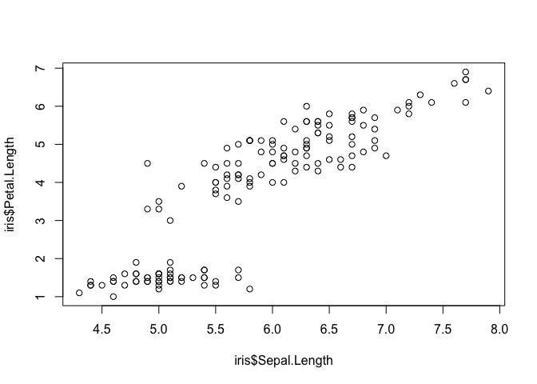
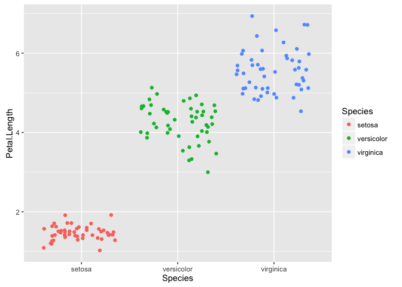
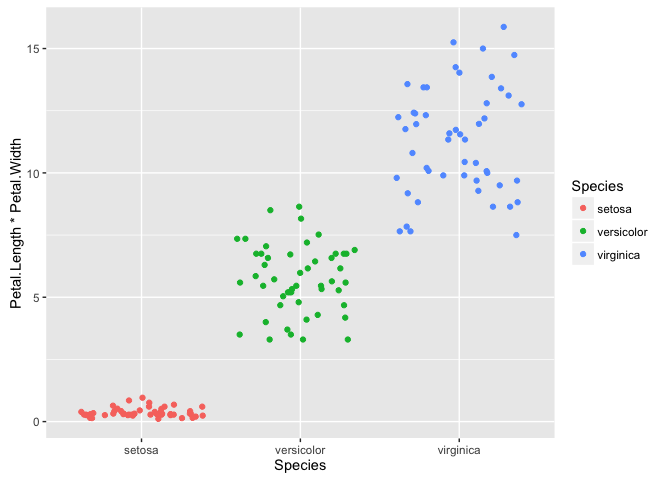
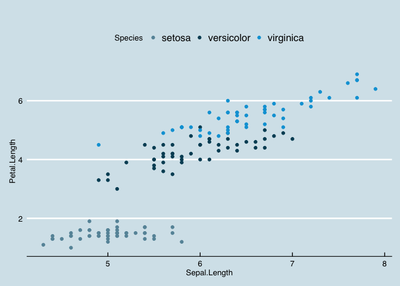
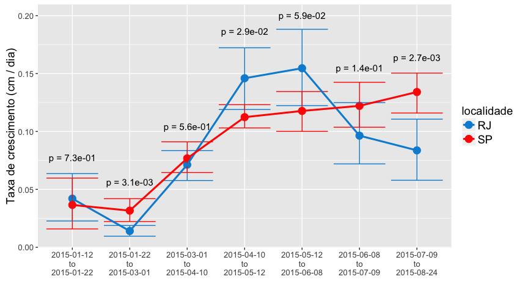

Why visualize?
==============

------------------------------------------------------------------------

    anscombe

       x1 x2 x3 x4    y1   y2    y3    y4
    1  10 10 10  8  8.04 9.14  7.46  6.58
    2   8  8  8  8  6.95 8.14  6.77  5.76
    3  13 13 13  8  7.58 8.74 12.74  7.71
    4   9  9  9  8  8.81 8.77  7.11  8.84
    5  11 11 11  8  8.33 9.26  7.81  8.47
    6  14 14 14  8  9.96 8.10  8.84  7.04
    7   6  6  6  8  7.24 6.13  6.08  5.25
    8   4  4  4 19  4.26 3.10  5.39 12.50
    9  12 12 12  8 10.84 9.13  8.15  5.56
    10  7  7  7  8  4.82 7.26  6.42  7.91
    11  5  5  5  8  5.68 4.74  5.73  6.89

------------------------------------------------------------------------

    # mean
    sapply(anscombe, mean)

          x1       x2       x3       x4       y1       y2       y3       y4 
    9.000000 9.000000 9.000000 9.000000 7.500909 7.500909 7.500000 7.500909 

    # variance
    sapply(anscombe, var)

           x1        x2        x3        x4        y1        y2        y3 
    11.000000 11.000000 11.000000 11.000000  4.127269  4.127629  4.122620 
           y4 
     4.123249 

    # correlation x y
    mapply(cor, anscombe[1:4], anscombe[5:8])

           x1        x2        x3        x4 
    0.8164205 0.8162365 0.8162867 0.8165214 

    # linear regression line
    mapply(function(x, y) summary(lm(y ~ x))$coef[,1], anscombe[1:4], anscombe[5:8])

                       x1       x2        x3        x4
    (Intercept) 3.0000909 3.000909 3.0024545 3.0017273
    x           0.5000909 0.500000 0.4997273 0.4999091

------------------------------------------------------------------------

Grammar of Graphics
-------------------

gpplot2 is a system built on the **grammar of graphics** (Wilkinson,
Anand and Grossman, 2005).

Components:
-----------

-   **data**
-   **aes**: aesthetic mappings
-   **geom**: geometric objects
-   **scale**: control mapping from data to aesthetics
-   **stat**: statistical transformation
-   **coord**: coordinate system
-   **facet**: faceting specification

data
----

**Must be a data frame!**

-   your data is very important, it's better to be clear
-   a data frame is easier to save than a multitude of vectors:
    reproducibility

aesthetic mappings
------------------

describe the way that variables are mapped to things that we can see on
the plot

geom
----

-   control the type of plot you create (e.g., geom\_point for
    scatterplots, geom\_histogram for histograms)

stat
----

-   transforms the data, typically by summarising it in some manner
-   can add new computed variables to the original dataset (e.g.,
    ..density..)

position adjustments
--------------------

-   normally used with discrete data
-   adjustments to deal with overlap

scales
------

-   control the mapping from data to aesthetics
-   control all aspects of the guides (axes + legends)
-   nomenclature: scale\_aesthetic\_nameofscale()
    -   e.g.: scale\_color\_manual, scale\_x\_discrete, ...

------------------------------------------------------------------------

see help(package="ggplot2")

basic structure
---------------

    ggplot(data, aes(x, y)) + geom

The iris data
-------------

    str(iris)

    'data.frame':   150 obs. of  5 variables:
     $ Sepal.Length: num  5.1 4.9 4.7 4.6 5 5.4 4.6 5 4.4 4.9 ...
     $ Sepal.Width : num  3.5 3 3.2 3.1 3.6 3.9 3.4 3.4 2.9 3.1 ...
     $ Petal.Length: num  1.4 1.4 1.3 1.5 1.4 1.7 1.4 1.5 1.4 1.5 ...
     $ Petal.Width : num  0.2 0.2 0.2 0.2 0.2 0.4 0.3 0.2 0.2 0.1 ...
     $ Species     : Factor w/ 3 levels "setosa","versicolor",..: 1 1 1 1 1 1 1 1 1 1 ...

Difference between the base R plot system and ggplot2
=====================================================

Scatterplot
===========

------------------------------------------------------------------------

    with(iris, plot(Sepal.Length, Petal.Length))

------------------------------------------------------------------------

    ggplot(iris, aes(Sepal.Length, Petal.Length)) + 
      geom_point()

Multiple histograms
===================

    par(mfrow = c(3, 1))
    with(subset(iris, Species == "setosa"), hist(Sepal.Length, col = "red", main = "setosa"))
    with(subset(iris, Species == "versicolor"), hist(Sepal.Length, col = "green", main = "versicolor"))
    with(subset(iris, Species == "virginica"), hist(Sepal.Length, col = "blue", main = "virginica"))

With ggplot2:
-------------

    ggplot(iris, aes(x = Sepal.Length, y = ..density.., fill = Species)) +
      geom_histogram(binwidth = 0.5) +
      facet_wrap(~Species, ncol = 1)

The ggplot2 advantages are not clear?
=====================================

automatic colors and legends
----------------------------

    ggplot(iris, aes(Sepal.Length, Petal.Length, color = Species)) +
      geom_point(size = 4)

or shapes
---------

    ggplot(iris, aes(Sepal.Length, Petal.Length, shape = Species)) +
      geom_point(size = 4)

mapping size to a forth variable
--------------------------------

    ggplot(iris, aes(Sepal.Length, Petal.Length, color = Species)) +
      geom_point(aes(size = Petal.Width))

What if we wanted to color and separate plot windows by species, create a legend and add a smooth line?
-------------------------------------------------------------------------------------------------------

------------------------------------------------------------------------

    ggplot(iris, aes(Sepal.Length, Petal.Length, color = Species)) + 
      geom_point() +
      geom_smooth(method = lm) +
      facet_wrap(~Species, scales = "free_x")

geoms
=====

smooth
------

    ggplot(iris, aes(Sepal.Length, Petal.Length)) +
      geom_point(size = 4) +
      geom_smooth(method = lm)

------------------------------------------------------------------------

    ggplot(iris, aes(Sepal.Length, Petal.Length, color = Species)) +
      geom_point(size = 4) +
      geom_smooth(method = lm)

------------------------------------------------------------------------

    ggplot(iris, aes(Sepal.Length, Petal.Length, color = Species)) +
      geom_point(size = 4) +
      geom_smooth(aes(group = 1), method = lm)

jitter and boxplot
------------------

    ggplot(iris, aes(Species, Petal.Length, color = Species)) +
      geom_jitter()

------------------------------------------------------------------------

    ggplot(iris, aes(Species, Petal.Length*Petal.Width, color = Species)) +
      geom_jitter()

------------------------------------------------------------------------

    ggplot(iris, aes(Species, Petal.Length*Petal.Width, fill = Species)) +
      geom_boxplot()

Histogram and density
---------------------

    ggplot(iris, aes(Petal.Length)) + 
      geom_histogram(binwidth = .2) 

------------------------------------------------------------------------

    ggplot(iris, aes(Petal.Length, fill = Species)) + 
      geom_histogram(binwidth = .1) 

------------------------------------------------------------------------

    ggplot(iris, aes(Petal.Length, fill = Species)) + 
      geom_histogram(aes(y = ..density..), binwidth = .1) 

------------------------------------------------------------------------

    # Density smooth
    ggplot(iris, aes(Petal.Length, fill = Species)) + 
      geom_density(alpha = .7) +
      theme_bw()

bar
---

    ggplot(msleep, aes(order, fill = vore)) + 
      geom_bar() +
      xlab("") +
      theme(axis.text.x = element_text(angle = 90, hjust = 1))

positioning in bar plots
========================

------------------------------------------------------------------------

    ggplot(dplyr::filter(msleep, !is.na(conservation)), 
           aes(vore, fill = conservation)) + 
      geom_bar(position = "stack")

------------------------------------------------------------------------

    ggplot(dplyr::filter(msleep, !is.na(conservation)), 
           aes(vore, fill = conservation)) + 
      geom_bar(position = "fill")

------------------------------------------------------------------------

    ggplot(dplyr::filter(msleep, !is.na(conservation)), 
           aes(vore, fill = conservation)) + 
      geom_bar(position = "dodge")

text
----

    ggplot(msleep, aes(bodywt, sleep_total, label = genus, color = vore)) + 
      geom_text(size = 3) +
      scale_x_log10() +
      theme_bw() +  
      ylab("sleep (hours)")

faceting
========

-   1d: `facet_wrap()`
-   2d: `facet_grid()`

<!-- -->

    ggplot(iris, aes(Petal.Length, fill = Species)) + 
      geom_density(color = NA) +
      facet_wrap(~Species, ncol = 1) + 
      theme_bw()

more themes from the ggthemes package
-------------------------------------

    p <- 
      ggplot(iris, aes(Sepal.Length, Petal.Length, color = Species)) + 
      geom_point()

------------------------------------------------------------------------

    p

    p + scale_color_wsj() + theme_wsj()

    p + scale_color_fivethirtyeight() + theme_fivethirtyeight()

    p + scale_color_economist() + theme_economist()

lines
-----

    # allele frequency
    f <- seq(0.05, 0.95, by = 0.05)

    # genotype frequencies
    hw <- 
      data.frame(allele_freq = f, f11 = f^2, f12 = 2*f*(1 - f), f22 = (1 - f)^2) %>%
      tidyr::gather(genotype, genotype_freq, f11:f22)

    ggplot(data = hw, aes(x = allele_freq, y = genotype_freq, group = genotype)) +
      geom_line(size = 2)

log transformation of the axes
------------------------------

    ggplot(data = msleep, aes(x = brainwt, y = bodywt, color = vore)) + 
      geom_point()

------------------------------------------------------------------------

    ggplot(data = msleep, aes(x = log10(brainwt), y = log10(bodywt), 
                              color = vore)) + 
      geom_point()

------------------------------------------------------------------------

    ggplot(data = msleep, aes(x = brainwt, y = bodywt, color = vore)) + 
      geom_point() +
      scale_x_log10() +
      scale_y_log10()

Color
-----

-   hcl color scheme

-   continuous:
    -   `scale_color_gradient()` and `scale_fill_gradient()`
    -   `scale_color_gradient2()` and `scale_fill_gradient2()`
    -   `scale_color_gradientn()` and `scale_fill_gradientn()`
-   discrete:
    -   `scale_color_hue()` and `scale_fill_hue()`
    -   `scale_color_brewer()` and `scale_fill_brewer()`
    -   many schemes from `ggthemes` package

RColorBrewer
------------

    RColorBrewer::display.brewer.all()

setting vs. mapping
-------------------

    ggplot(data = iris, aes(x = Petal.Length, y = Petal.Width, 
                            color = "darkblue")) +
      geom_point()

------------------------------------------------------------------------

    ggplot(data = iris, aes(x = Petal.Length, y = Petal.Width)) +
      geom_point(color = "darkblue")

------------------------------------------------------------------------

    ggplot(data = msleep, aes(x = brainwt, y = bodywt, color = vore)) + 
      geom_point() +
      scale_x_log10() +
      scale_y_log10() +
      scale_colour_colorblind() #from ggthemes

getting a bit more sophisticated
================================

------------------------------------------------------------------------

------------------------------------------------------------------------

Hands on
========
