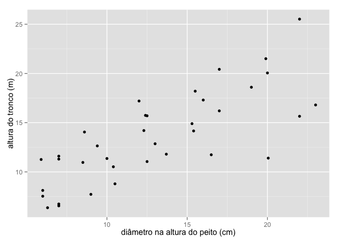
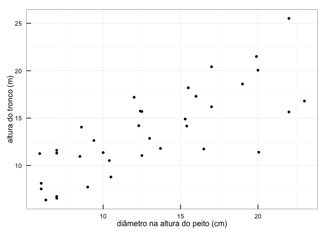
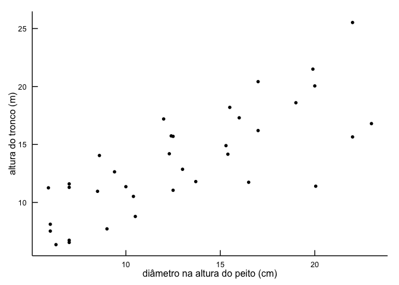
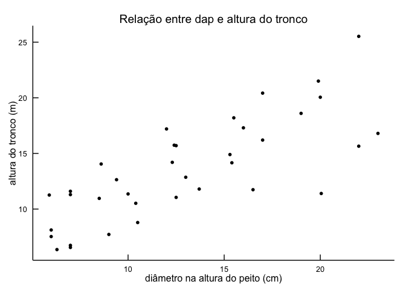
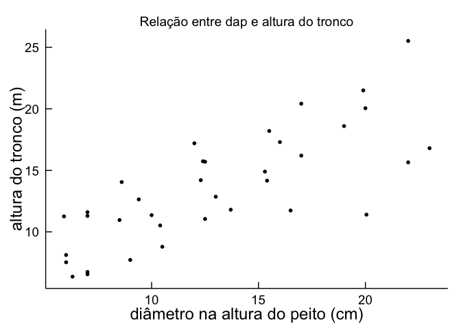
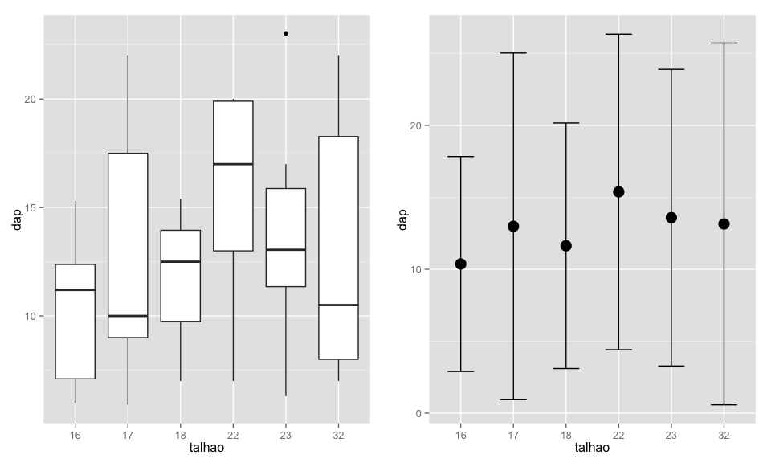
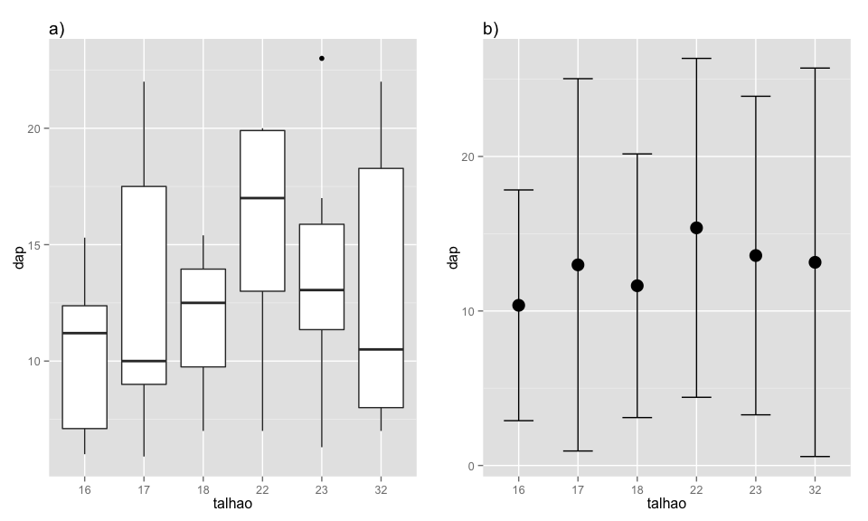
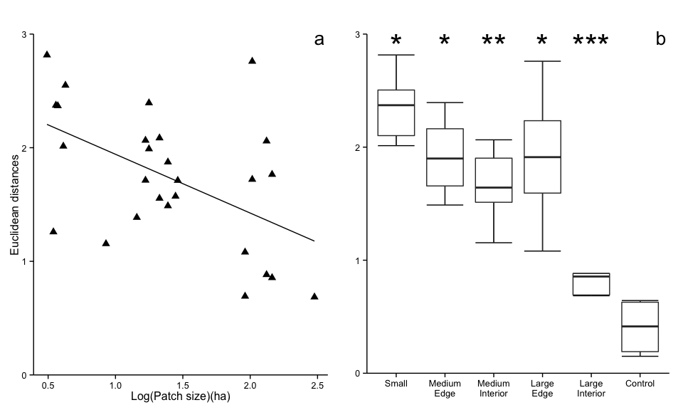

    library(ggplot2)
    library(grid)

The basic structure to create a plot with `ggplot2` is the following:

    ggplot(data = my_data_frame, mapping = aes(x, y)) + geom()

We first create a plot object with the `ggplot()` function. The first
argument is `data`, the data frame where the variables are stored. The
second argument is `mapping`, which specifies the mapping from data to
aesthestic attributes (`aes`), i.e., which variables should be ploted on
the x and y axes, what colors, shapes or line types should be used, etc.

If you try to plot such a plot object, nothing will happen. That's is
because you need to add a `geom` to tell ggplot what kind of geometric
object you want to plot.

For instance, `geom_point()` for points, `geom_boxplot()` for boxplots,
`geom_histogram()` for histograms, and so on. For the complete list of
geoms, check the [online
documentation](http://docs.ggplot2.org/0.9.3.1/index.html) or:

    help(package = "ggplot2")

Notice the we added a `geom` with a "*+*" sign. The "+" sign is used to
add layers to a plot. In `ggplot2` we create plots incrementally, adding
components to it step by step, in different layers.

Now let's practice!

We'll use the *E. saligna* data:

    esaligna <- read.csv("http://ecologia.ib.usp.br/bie5782/lib/exe/fetch.php?media=dados:esaligna.csv")

    str(esaligna)

    ## 'data.frame':    36 obs. of  9 variables:
    ##  $ arvore: int  6 8 7 8 9 9 1 2 1 2 ...
    ##  $ classe: Factor w/ 4 levels "a","b","c","d": 3 2 3 1 1 2 3 3 1 1 ...
    ##  $ talhao: int  22 23 32 32 32 32 22 22 22 23 ...
    ##  $ dap   : num  19.9 12.4 16.5 9 7 10.5 13 20 7 6.3 ...
    ##  $ ht    : num  21.5 15.74 11.74 7.72 6.55 ...
    ##  $ tronco: num  183.6 42.3 60.6 12.3 11.9 ...
    ##  $ sobra : num  20.42 6.58 11.35 9.99 7.97 ...
    ##  $ folha : num  8.57 2.52 48.52 27.67 7.76 ...
    ##  $ total : num  212.6 51.4 120.5 50 27.6 ...

### Editing graphical parameters

Make a scatterplot of `dap` vs. `ht`:

    p <- ggplot(esaligna, aes(x = dap, y = ht)) + 
      geom_point() +
      xlab("diâmetro na altura do peito (cm)") +
      ylab("altura do tronco (m)")

    p

We added the components `xlab` and `ylab` to set the axes labels.

**Put the tick marks inside the area of the plot**

Since we store the plot in the object `p` we can add layers to it:

    p + 
      theme_bw() + 
      theme(axis.ticks.length = unit(-0.25, "cm"), 
            axis.ticks.margin = unit(0.5, "cm"))

First we used `theme_bw()` to set the black and white theme so we can
better visualize the tick marks. To bring the *ticks* to inside the area
of the plot, we can use `theme()` setting the option `axis.ticks.length`
to a negative value. Then we set `axis.ticks.margin` to 0.5 to increase
the distance of the ticks to the tick labels, so they don't overlap. The
function `unit()` comes from the `grid` package, which we attached at
the beginning of this document.

**The "L" format with no grid lines**

We can do this by adding the `theme_classic()` component. Notice that we
add `theme_classic()` before `theme()` to avoid the tick marks settings
be hided behind.

    p <- p + 
      theme_bw() + 
      theme_classic() +
      theme(axis.ticks.length = unit(-0.25, "cm"), 
            axis.ticks.margin = unit(0.5, "cm"))

    p

**Add an informative title**

We can add a title with the `labs()` component:

    p <- p + labs(title = "Relação entre dap e altura do tronco")

    p

**Increase the font size**

To increase the font size we also use `theme()`. While the contents of
the legend and axes are controlled by the scale, the details of the
rendering are controlled by the theming system. So whenever you need to
change these details, think of `theme()`.

In `ggplot2` the axis labels are called `axis.title` and tick labels are
`axis.text`.

    p + theme(axis.title = element_text(size = 18),
              axis.text = element_text(size = 14))

### Two plots side by side.

The first plot will be a boxplot to visualize the distribution of the
variable `dap` as a function of `talhao`. The second one will be
simular, but just showing the mean and standard deviation.

    p_box <- 
      ggplot(esaligna, aes(factor(talhao), dap)) +
      geom_boxplot() +
      xlab("talhao")
      
    p_media_desvio <-
      ggplot(esaligna, aes(factor(talhao), dap)) + 
      stat_summary(fun.y = "mean", geom = "point", size = 5) +
      stat_summary(fun.data = "mean_sdl", geom = "errorbar", width = 0.5) +
      xlab("talhao")

In order to create `p_media_desvio` we used the `stat_summary`
component, specifying that we want to *summarize* the values of the y
axis by each value of x with the mean, then plot these means with points
of the size 5. Then we used the `stat_summary` again, this time to
summarise the values of y with the function `mean_sdl` to get the range
of the data ± 2 standard deviations from the mean. We want to draw this
range on the plot as errorbars.

To put both plots on the same windows, we'll use the function
`pushViewport` from the `grid` package.

First we create a grid with 1 row and 2 columns, then we "print" each
plot in a position of this grid.

    pushViewport(viewport(layout = grid.layout(1, 2)))
    print(p_box, vp = viewport(layout.pos.row = 1, layout.pos.col = 1))
    print(p_media_desvio, vp = viewport(layout.pos.row = 1, layout.pos.col = 2))

\*\* Assigning a lable to each plot in the grid\*\*

We can add a label with `labs()` as a title and align it to the left:

    p_box <-
      p_box + 
      labs(title = "a)") + 
      theme(plot.title = element_text(hjust = 0))

    p_media_desvio <-
      p_media_desvio + 
      labs(title = "b)") + 
      theme(plot.title = element_text(hjust = 0))

    pushViewport(viewport(layout = grid.layout(1, 2)))
    print(p_box, vp = viewport(layout.pos.row = 1, layout.pos.col = 1))
    print(p_media_desvio, vp = viewport(layout.pos.row = 1, layout.pos.col = 2))

### Guessing the code

In this exercise we'll try to recreate [2 plots made with the R base
system](http://ecologia.ib.usp.br/bie5782/lib/exe/detail.php?id=bie5782%3A01_curso_atual%3Aexercicios5&media=bie5782:01_curso2009:material:exercicio3.jpeg),
but of course we'll use `ggplot2`!

Read the data:

    dat <- read.csv("http://ecologia.ib.usp.br/bie5782/lib/exe/fetch.php?media=bie5782:01_curso2009:material:exercicio3.csv")

First plot:

    p_a <- 
      ggplot(data = dat, aes(x1, y1)) + 
      geom_point(size = 3, shape = 17) + 
      geom_smooth(method = "lm", se = FALSE, color = "black") +
      xlab("Log(Patch size)(ha)") +
      ylab("Euclidean distances") + 
      labs(title = "a") + 
      theme_classic() +
      theme(plot.title = element_text(hjust = .99, vjust = -1.5, size = 20)) +
      coord_cartesian(ylim = c(0, 3))

We used the argument `alpha` in `geom_point()` to add some transparency
to the points. With `geom_smooth()`, we add a smooth line according to a
linear regression model (`method = "lm"`).

Second plot:

    p_b <- 
      ggplot(data = dat, aes(factor(y2), x2)) + 
      stat_boxplot(geom ='errorbar') + 
      geom_boxplot(outlier.shape = NA) +
      scale_x_discrete(labels=c("Small", "Medium\nEdge", "Medium\nInterior",
                                "Large\nEdge", "Large\nInterior", "Control")) +
      labs(title = "b") +
      theme_classic() +
      theme(axis.title = element_blank(), 
            plot.title = element_text(hjust = .99, vjust = -1.5, size = 20)) +
      coord_cartesian(ylim = c(0 ,3)) +
      annotate("text", x = 1:6, y = 2.9, label = c("*", "*", "**", "*", "***", ""), 
               size = 12) 

In this boxplot we used:

-   `outlier.shape = NA` to remove outliers from the plot;
-   `stat_boxplot(geom = "errorbar")` as a trick to add horizontal line
    to the end of whiskers lines;
-   `scale_x_discrete()` to add names to the x axis (*discrete* because
    we have a discrete variable on the x axis);
-   `theme(axis.title = element_blank())` to remove the axes labels;
-   `annotate()` to add the asterisks of significance.

To finish, we need to put the plots side by side:

    pushViewport(viewport(layout = grid.layout(1, 2)))
    print(p_a, vp = viewport(layout.pos.row = 1, layout.pos.col = 1))
    print(p_b, vp = viewport(layout.pos.row = 1, layout.pos.col = 2))

