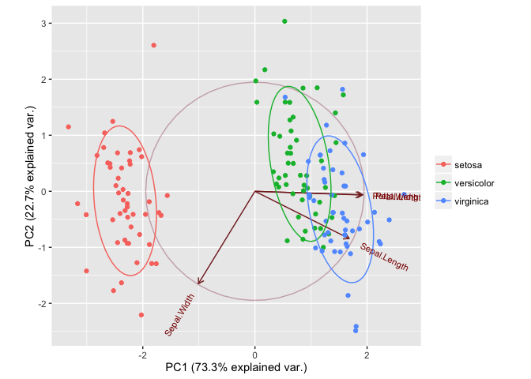

    head(iris)

      Sepal.Length Sepal.Width Petal.Length Petal.Width Species
    1          5.1         3.5          1.4         0.2  setosa
    2          4.9         3.0          1.4         0.2  setosa
    3          4.7         3.2          1.3         0.2  setosa
    4          4.6         3.1          1.5         0.2  setosa
    5          5.0         3.6          1.4         0.2  setosa
    6          5.4         3.9          1.7         0.4  setosa

    iris_pca <- prcomp(log(iris[1:4]), center = TRUE, scale. = TRUE) 

    iris_pca

    Standard deviations:
    [1] 1.7124583 0.9523797 0.3647029 0.1656840

    Rotation:
                        PC1         PC2        PC3         PC4
    Sepal.Length  0.5038236 -0.45499872  0.7088547  0.19147575
    Sepal.Width  -0.3023682 -0.88914419 -0.3311628 -0.09125405
    Petal.Length  0.5767881 -0.03378802 -0.2192793 -0.78618732
    Petal.Width   0.5674952 -0.03545628 -0.5829003  0.58044745

    summary(iris_pca)

    Importance of components:
                              PC1    PC2     PC3     PC4
    Standard deviation     1.7125 0.9524 0.36470 0.16568
    Proportion of Variance 0.7331 0.2268 0.03325 0.00686
    Cumulative Proportion  0.7331 0.9599 0.99314 1.00000

    # PC's 
    head(iris_pca$x)

               PC1        PC2         PC3          PC4
    [1,] -2.406639 -0.3969554  0.19396467  0.004779476
    [2,] -2.223539  0.6901804  0.35000151  0.048868378
    [3,] -2.581105  0.4275418  0.01889761  0.049909545
    [4,] -2.450869  0.6860074 -0.06874595 -0.149646465
    [5,] -2.536853 -0.5082516  0.02932259 -0.040048202
    [6,] -1.841495 -1.2899381 -0.25276831  0.163890597

    #devtools::install_github("vqv/ggbiplot")
    library(ggbiplot)

    ggbiplot(iris_pca, obs.scale = 1, var.scale = 1, groups = iris$Species, 
             ellipse = TRUE, circle = TRUE) + 
      scale_color_discrete(name = '')

Other functions:

-   `printcomp()` (stats)
-   `PCA()` (FactorMiner)
