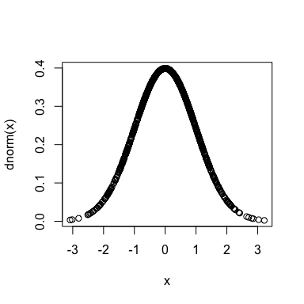
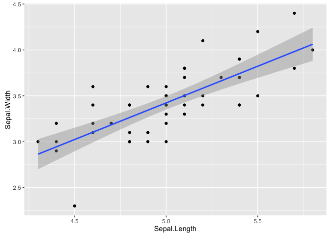
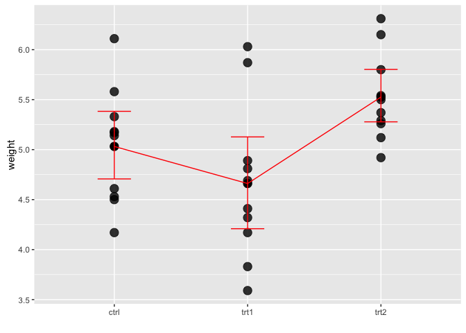

Probability and distributions
=============================

generate a sample
-----------------

    sample(1:10)

     [1]  3  8  5  9  1  6  7  4  2 10

    sample(1:10, 5)

    [1]  5  6  3  2 10

    sample(0:1, 10, replace = TRUE)

     [1] 0 1 0 1 1 0 0 0 0 0

    sample(0:1, 10, replace = TRUE, prob = c(0.9, 0.1))

     [1] 1 0 0 0 0 0 0 0 1 0

random number generation giving distribution
--------------------------------------------

    rnorm()
    rbinom()
    rpois()
    .
    .
    .

distributions
-------------

    dnorm()
    dbinom()
    dpois()
    .
    .
    .

    ?Distributions

example: normal distribution
----------------------------

    x <- rnorm(1000, mean = 0, sd = 1)
    plot(x = x, y = dnorm(x))

cumulative distribution functions
---------------------------------

    pnorm()
    pbinom()
    ppois()
    .
    .
    .

------------------------------------------------------------------------

    pnorm(1, mean = 0, sd = 1)

    [1] 0.8413447

    pnorm(1, mean = 0, sd = 1) - pnorm(-1, mean = 0, sd = 1)

    [1] 0.6826895

    pnorm(2, mean = 0, sd = 1) - pnorm(-2, mean = 0, sd = 1)

    [1] 0.9544997

    pnorm(3, mean = 0, sd = 1) - pnorm(-3, mean = 0, sd = 1)

    [1] 0.9973002

summary statistics for a single group
-------------------------------------

    x <- rnorm(50)
    mean(x)

    [1] 0.3344822

    median(x)

    [1] 0.3780431

    sd(x)

    [1] 1.067831

    var(x)

    [1] 1.140264

    summary(x)

       Min. 1st Qu.  Median    Mean 3rd Qu.    Max. 
    -2.2900 -0.2978  0.3780  0.3345  1.1810  2.5390 

    quantile(x)

            0%        25%        50%        75%       100% 
    -2.2901963 -0.2978351  0.3780431  1.1809499  2.5392108 

    quantile(x, seq(from = 0, to = 1, by = 0.1))

             0%         10%         20%         30%         40%         50% 
    -2.29019627 -0.89289059 -0.50379726 -0.17318361  0.02609165  0.37804312 
            60%         70%         80%         90%        100% 
     0.66991618  0.93059092  1.32972425  1.58635722  2.53921084 

summary statistics by groups
----------------------------

    data(msleep, package = "ggplot2")
    tapply(msleep$sleep_total, msleep$order, mean)

       Afrosoricida    Artiodactyla       Carnivora         Cetacea 
          15.600000        4.516667       10.116667        4.500000 
         Chiroptera       Cingulata Didelphimorphia   Diprotodontia 
          19.800000       17.750000       18.700000       12.400000 
     Erinaceomorpha      Hyracoidea      Lagomorpha     Monotremata 
          10.200000        5.666667        8.400000        8.600000 
     Perissodactyla          Pilosa        Primates     Proboscidea 
           3.466667       14.400000       10.500000        3.600000 
           Rodentia      Scandentia    Soricomorpha 
          12.468182        8.900000       11.100000 

    aggregate(msleep[c("sleep_total", "bodywt")], 
              by = list(order = msleep$order, vore = msleep$vore),
              FUN = mean, na.rm = TRUE)

                 order    vore sleep_total       bodywt
    1        Carnivora   carni   10.116667   57.7052500
    2          Cetacea   carni    4.500000  342.1700000
    3        Cingulata   carni   17.400000    3.5000000
    4  Didelphimorphia   carni   19.400000    0.3700000
    5         Primates   carni   11.000000    1.4000000
    6         Rodentia   carni   14.500000    0.0280000
    7     Artiodactyla   herbi    3.600000  320.7590000
    8    Diprotodontia   herbi   11.100000    1.1000000
    9       Hyracoidea   herbi    5.800000    2.7875000
    10      Lagomorpha   herbi    8.400000    2.5000000
    11  Perissodactyla   herbi    3.466667  305.1670000
    12          Pilosa   herbi   14.400000    3.8500000
    13        Primates   herbi    9.500000    1.6700000
    14     Proboscidea   herbi    3.600000 4600.5000000
    15        Rodentia   herbi   13.356250    0.3175625
    16      Chiroptera insecti   19.800000    0.0165000
    17       Cingulata insecti   18.100000   60.0000000
    18     Monotremata insecti    8.600000    4.5000000
    19    Soricomorpha insecti    8.400000    0.0750000
    20    Afrosoricida    omni   15.600000    0.9000000
    21    Artiodactyla    omni    9.100000   86.2500000
    22 Didelphimorphia    omni   18.000000    1.7000000
    23  Erinaceomorpha    omni   10.100000    0.7700000
    24        Primates    omni   10.550000   16.3508000
    25        Rodentia    omni    8.500000    0.5220000
    26      Scandentia    omni    8.900000    0.1040000
    27    Soricomorpha    omni   11.433333    0.0280000

    library(dplyr)
    msleep %>% 
      group_by(order, vore) %>% 
      summarise(mean_sleep = mean(sleep_total), mean_weight = mean(bodywt, na.rm = TRUE))

    Source: local data frame [32 x 4]
    Groups: order [?]

                 order    vore mean_sleep mean_weight
                 (chr)   (chr)      (dbl)       (dbl)
    1     Afrosoricida    omni   15.60000     0.90000
    2     Artiodactyla   herbi    3.60000   320.75900
    3     Artiodactyla    omni    9.10000    86.25000
    4        Carnivora   carni   10.11667    57.70525
    5          Cetacea   carni    4.50000   342.17000
    6       Chiroptera insecti   19.80000     0.01650
    7        Cingulata   carni   17.40000     3.50000
    8        Cingulata insecti   18.10000    60.00000
    9  Didelphimorphia   carni   19.40000     0.37000
    10 Didelphimorphia    omni   18.00000     1.70000
    ..             ...     ...        ...         ...

statistical tests
=================

------------------------------------------------------------------------

    intake <- c(1260, 1300, 1350, 1480, 1530, 1560, 1620, 
        1800, 1800, 1970, 2100)

one sample t test
-----------------

-   assumption: sample come from a normally distributed data

<!-- -->

    t.test(intake, mu = 1800)

        One Sample t-test

    data:  intake
    t = -2.2295, df = 10, p-value = 0.04988
    alternative hypothesis: true mean is not equal to 1800
    95 percent confidence interval:
     1431.022 1799.887
    sample estimates:
    mean of x 
     1615.455 

Wilcoxon signed-rank test
-------------------------

-   distribution free (nonparametric)
-   replace data with order statistics

One sample Wilcoxon:

1.  subtract theoretical mean
2.  rank the differences, ignoring the sign
3.  compute the sum of positive or negative ranks

------------------------------------------------------------------------

    wilcox.test(intake, mu = 1800)

        Wilcoxon signed rank test with continuity correction

    data:  intake
    V = 6, p-value = 0.05802
    alternative hypothesis: true location is not equal to 1800

two-sample t test
-----------------

-   assumption: the two samples come from distributions with same mean

data:

    sex <- rep(c("m", "f"), c(9, 13))
    expend <- c(2200, 2750, 2910, 2830, 2380, 2100, 2315, 2312,
                2195, 1800, 1790, 1930, 1935, 2430, 2000, 2600,
                1470, 7.90, 1880, 1790, 1810, 1940)

    energy <- data.frame(sex, expend)

    str(energy)

    'data.frame':   22 obs. of  2 variables:
     $ sex   : Factor w/ 2 levels "f","m": 2 2 2 2 2 2 2 2 2 1 ...
     $ expend: num  2200 2750 2910 2830 2380 ...

------------------------------------------------------------------------

    t.test(expend~sex, data = energy)

        Welch Two Sample t-test

    data:  expend by sex
    t = -3.2726, df = 18.567, p-value = 0.004099
    alternative hypothesis: true difference in means is not equal to 0
    95 percent confidence interval:
     -1057.9584  -231.7835
    sample estimates:
    mean in group f mean in group m 
           1798.685        2443.556 

two-sample Wilcoxon test
------------------------

-   replace data by their rank (without regard to grouping)
-   sum the ranks in one group
-   sample n1 values without replacement from 1 to n1+n2

<!-- -->

    wilcox.test(expend~sex, data = energy)

        Wilcoxon rank sum test with continuity correction

    data:  expend by sex
    W = 12, p-value = 0.002122
    alternative hypothesis: true location shift is not equal to 0

paired t test
-------------

-   two measures on the same experimental unit
-   take the differences and reduce the problem to that of a one-sample
    test

data:

    plant <- CO2$Plant[CO2$Type == "Quebec" & CO2$Treatment == "nonchilled"]
    nonchilled <- CO2$uptake[CO2$Type == "Quebec" & CO2$Treatment == "nonchilled"]
    chilled <- CO2$uptake[CO2$Type == "Quebec" & CO2$Treatment == "chilled"]

    plant_co2 <- data.frame(plant, chilled, nonchilled)

    str(plant_co2)

    'data.frame':   21 obs. of  3 variables:
     $ plant     : Ord.factor w/ 12 levels "Qn1"<"Qn2"<"Qn3"<..: 1 1 1 1 1 1 1 2 2 2 ...
     $ chilled   : num  14.2 24.1 30.3 34.6 32.5 35.4 38.7 9.3 27.3 35 ...
     $ nonchilled: num  16 30.4 34.8 37.2 35.3 39.2 39.7 13.6 27.3 37.1 ...

------------------------------------------------------------------------

    t.test(nonchilled, chilled, data = plant_co2, paired = TRUE)

        Paired t-test

    data:  nonchilled and chilled
    t = 6.3979, df = 20, p-value = 3.054e-06
    alternative hypothesis: true difference in means is not equal to 0
    95 percent confidence interval:
     2.413432 4.748473
    sample estimates:
    mean of the differences 
                   3.580952 

    # compare with:
    #t.test(nonchilled, chilled, data = plant_co2, paired = FALSE)

paired Wilcoxon test
--------------------

-   same as a one-sample Wilcoxon signed-rank test on the differences

<!-- -->

    wilcox.test(nonchilled, chilled, data = plant_co2, paired = TRUE)

        Wilcoxon signed rank test with continuity correction

    data:  nonchilled and chilled
    V = 210, p-value = 9.569e-05
    alternative hypothesis: true location shift is not equal to 0

Hands on
========

------------------------------------------------------------------------

look at the documentation of the t.test function

    ?t.test

change the argument values and test again, e.g.:

    t.test(intake, mu = 1800, conf.level = 0.99)
    t.test(expend~sex, data = energy, var.equal = TRUE)

check the structure

    my_t_test <- t.test(intake, mu = 1800)
    str(my_t_test)

extract components

    my_t_test$p.value

simple linear regression
------------------------

    iris_setosa <- subset(iris, Species == "setosa")

------------------------------------------------------------------------

    summary(lm(Sepal.Length~Sepal.Width, data = iris_setosa))

    Call:
    lm(formula = Sepal.Length ~ Sepal.Width, data = iris_setosa)

    Residuals:
         Min       1Q   Median       3Q      Max 
    -0.52476 -0.16286  0.02166  0.13833  0.44428 

    Coefficients:
                Estimate Std. Error t value Pr(>|t|)    
    (Intercept)   2.6390     0.3100   8.513 3.74e-11 ***
    Sepal.Width   0.6905     0.0899   7.681 6.71e-10 ***
    ---
    Signif. codes:  0 '***' 0.001 '**' 0.01 '*' 0.05 '.' 0.1 ' ' 1

    Residual standard error: 0.2385 on 48 degrees of freedom
    Multiple R-squared:  0.5514,    Adjusted R-squared:  0.542 
    F-statistic: 58.99 on 1 and 48 DF,  p-value: 6.71e-10

------------------------------------------------------------------------

    library(ggplot2)
    ggplot(data = iris_setosa, aes(x = Sepal.Length, y = Sepal.Width)) +
      geom_point() +
      geom_smooth(method = "lm")

*Iris setosa*

Correlation
===========

------------------------------------------------------------------------

**Pearson correlation**

    cor(iris_setosa$Petal.Length, iris_setosa$Petal.Width)

    [1] 0.33163

    #Are the correlations different from 0?
    cor.test(iris_setosa$Petal.Length, iris_setosa$Petal.Width)

        Pearson's product-moment correlation

    data:  iris_setosa$Petal.Length and iris_setosa$Petal.Width
    t = 2.4354, df = 48, p-value = 0.01864
    alternative hypothesis: true correlation is not equal to 0
    95 percent confidence interval:
     0.05870091 0.55842995
    sample estimates:
        cor 
    0.33163 

------------------------------------------------------------------------

    cor(iris_setosa[1:4])

                 Sepal.Length Sepal.Width Petal.Length Petal.Width
    Sepal.Length    1.0000000   0.7425467    0.2671758   0.2780984
    Sepal.Width     0.7425467   1.0000000    0.1777000   0.2327520
    Petal.Length    0.2671758   0.1777000    1.0000000   0.3316300
    Petal.Width     0.2780984   0.2327520    0.3316300   1.0000000

------------------------------------------------------------------------

**Spearman correlation**

    cor.test(iris_setosa$Petal.Length, iris_setosa$Petal.Width, 
             method = "spearman")

        Spearman's rank correlation rho

    data:  iris_setosa$Petal.Length and iris_setosa$Petal.Width
    S = 15178, p-value = 0.05683
    alternative hypothesis: true rho is not equal to 0
    sample estimates:
          rho 
    0.2711414 

one-way analysis of variance
----------------------------

-   one-way classifications of data
-   description similar to a regression analysis
-   descriptive variable needs to be a factor

<!-- -->

    anova(lm(weight~group, data = PlantGrowth))

    Analysis of Variance Table

    Response: weight
              Df  Sum Sq Mean Sq F value  Pr(>F)  
    group      2  3.7663  1.8832  4.8461 0.01591 *
    Residuals 27 10.4921  0.3886                  
    ---
    Signif. codes:  0 '***' 0.001 '**' 0.01 '*' 0.05 '.' 0.1 ' ' 1

------------------------------------------------------------------------

not assuming equal variances:

    oneway.test(weight~group, data = PlantGrowth)

        One-way analysis of means (not assuming equal variances)

    data:  weight and group
    F = 5.181, num df = 2.000, denom df = 17.128, p-value = 0.01739

------------------------------------------------------------------------

**OK, there is a difference between groups, but where the difference
lies?**

------------------------------------------------------------------------

    pairwise.t.test(PlantGrowth$weight, PlantGrowth$group)

        Pairwise comparisons using t tests with pooled SD 

    data:  PlantGrowth$weight and PlantGrowth$group 

         ctrl  trt1 
    trt1 0.194 -    
    trt2 0.175 0.013

    P value adjustment method: holm 

Kruskal-Wallis test
-------------------

-   nonparametric counterpart of the one-way analysis of variance
-   data are replaced with their rankings without regard to grouping
-   based on the SSB calculated from average ranks

<!-- -->

    kruskal.test(weight~group, data = PlantGrowth)

        Kruskal-Wallis rank sum test

    data:  weight by group
    Kruskal-Wallis chi-squared = 7.9882, df = 2, p-value = 0.01842

two-way analysis of variance
----------------------------

-   cross classified data according to several criteria
-   balanced design

<!-- -->

    anova(lm(uptake~Type+Treatment, data = CO2))

    Analysis of Variance Table

    Response: uptake
              Df Sum Sq Mean Sq F value    Pr(>F)    
    Type       1 3365.5  3365.5  50.923 3.679e-10 ***
    Treatment  1  988.1   988.1  14.951 0.0002218 ***
    Residuals 81 5353.3    66.1                      
    ---
    Signif. codes:  0 '***' 0.001 '**' 0.01 '*' 0.05 '.' 0.1 ' ' 1

-   nonparametric counterpart: `friedman.test()`

tabular data
============

------------------------------------------------------------------------

    treatments <- matrix(c(652, 1537, 598, 242, 36, 46, 38, 21, 218, 
        327, 106, 67), nrow = 3, byrow = T)
    colnames(treatments) <- c("0", "1-150", "151-300", ">300")
    rownames(treatments) <- c("treatment1", "treatment2", "treatment3")

    treatments

                 0 1-150 151-300 >300
    treatment1 652  1537     598  242
    treatment2  36    46      38   21
    treatment3 218   327     106   67

chi-squared test
----------------

    chisq.test(treatments)

        Pearson's Chi-squared test

    data:  treatments
    X-squared = 51.656, df = 6, p-value = 2.187e-09

-   `chisq.test()` can be used on raw and untabulated data.

------------------------------------------------------------------------

    E <- chisq.test(treatments)$expected
    O <- chisq.test(treatments)$observed
    (O-E)^2/E

                        0    1-150   151-300      >300
    treatment1  4.1055981 1.612783 0.6874502 0.8858331
    treatment2  0.3007537 7.815444 4.5713926 6.8171090
    treatment3 15.3563704 1.875645 7.0249243 0.6023355

multiple regression
-------------------

    data(cystfibr, package = "ISwR")
    str(cystfibr)

    'data.frame':   25 obs. of  10 variables:
     $ age   : int  7 7 8 8 8 9 11 12 12 13 ...
     $ sex   : int  0 1 0 1 0 0 1 1 0 1 ...
     $ height: int  109 112 124 125 127 130 139 150 146 155 ...
     $ weight: num  13.1 12.9 14.1 16.2 21.5 17.5 30.7 28.4 25.1 31.5 ...
     $ bmp   : int  68 65 64 67 93 68 89 69 67 68 ...
     $ fev1  : int  32 19 22 41 52 44 28 18 24 23 ...
     $ rv    : int  258 449 441 234 202 308 305 369 312 413 ...
     $ frc   : int  183 245 268 146 131 155 179 198 194 225 ...
     $ tlc   : int  137 134 147 124 104 118 119 103 128 136 ...
     $ pemax : int  95 85 100 85 95 80 65 110 70 95 ...

    summary(lm(pemax~age+sex+height+weight+bmp+fev1+rv+frc+tlc, data=cystfibr))

    Call:
    lm(formula = pemax ~ age + sex + height + weight + bmp + fev1 + 
        rv + frc + tlc, data = cystfibr)

    Residuals:
        Min      1Q  Median      3Q     Max 
    -37.338 -11.532   1.081  13.386  33.405 

    Coefficients:
                Estimate Std. Error t value Pr(>|t|)
    (Intercept) 176.0582   225.8912   0.779    0.448
    age          -2.5420     4.8017  -0.529    0.604
    sex          -3.7368    15.4598  -0.242    0.812
    height       -0.4463     0.9034  -0.494    0.628
    weight        2.9928     2.0080   1.490    0.157
    bmp          -1.7449     1.1552  -1.510    0.152
    fev1          1.0807     1.0809   1.000    0.333
    rv            0.1970     0.1962   1.004    0.331
    frc          -0.3084     0.4924  -0.626    0.540
    tlc           0.1886     0.4997   0.377    0.711

    Residual standard error: 25.47 on 15 degrees of freedom
    Multiple R-squared:  0.6373,    Adjusted R-squared:  0.4197 
    F-statistic: 2.929 on 9 and 15 DF,  p-value: 0.03195

anova table for multiple regression
-----------------------------------

    anova(lm(pemax~age+sex+height+weight+bmp+fev1+rv+frc+tlc, data=cystfibr))

    Analysis of Variance Table

    Response: pemax
              Df  Sum Sq Mean Sq F value   Pr(>F)   
    age        1 10098.5 10098.5 15.5661 0.001296 **
    sex        1   955.4   955.4  1.4727 0.243680   
    height     1   155.0   155.0  0.2389 0.632089   
    weight     1   632.3   632.3  0.9747 0.339170   
    bmp        1  2862.2  2862.2  4.4119 0.053010 . 
    fev1       1  1549.1  1549.1  2.3878 0.143120   
    rv         1   561.9   561.9  0.8662 0.366757   
    frc        1   194.6   194.6  0.2999 0.592007   
    tlc        1    92.4    92.4  0.1424 0.711160   
    Residuals 15  9731.2   648.7                    
    ---
    Signif. codes:  0 '***' 0.001 '**' 0.01 '*' 0.05 '.' 0.1 ' ' 1

logistic regression
-------------------

    smoking <- gl(2, 1, 8, c("No", "Yes"))
    obesity <- gl(2, 2, 8, c("No", "Yes"))
    snoring <- gl(2, 4, 8, c("No", "Yes"))
    n.tot <- c(60, 17, 8, 2, 187, 85, 51, 23)
    prop.hyp <- c(5, 2, 1, 0, 35, 13, 15, 8)/n.tot
    hyp_data <- data.frame(smoking, obesity, snoring, prop.hyp, n.tot)

------------------------------------------------------------------------

    summary(glm(prop.hyp~smoking+obesity+snoring, binomial, weights = n.tot, 
                data = hyp_data))

    Call:
    glm(formula = prop.hyp ~ smoking + obesity + snoring, family = binomial, 
        data = hyp_data, weights = n.tot)

    Deviance Residuals: 
           1         2         3         4         5         6         7  
    -0.04344   0.54145  -0.25476  -0.80051   0.19759  -0.46602  -0.21262  
           8  
     0.56231  

    Coefficients:
                Estimate Std. Error z value Pr(>|z|)    
    (Intercept) -2.37766    0.38018  -6.254    4e-10 ***
    smokingYes  -0.06777    0.27812  -0.244   0.8075    
    obesityYes   0.69531    0.28509   2.439   0.0147 *  
    snoringYes   0.87194    0.39757   2.193   0.0283 *  
    ---
    Signif. codes:  0 '***' 0.001 '**' 0.01 '*' 0.05 '.' 0.1 ' ' 1

    (Dispersion parameter for binomial family taken to be 1)

        Null deviance: 14.1259  on 7  degrees of freedom
    Residual deviance:  1.6184  on 4  degrees of freedom
    AIC: 34.537

    Number of Fisher Scoring iterations: 4

Bibliography
------------

-   [Peter Dalgaard. Introductory Statistics with R. 2nd Edition.
    Springer,
    2008.](http://www.academia.dk/BiologiskAntropologi/Epidemiologi/PDF/Introductory_Statistics_with_R__2nd_ed.pdf)
